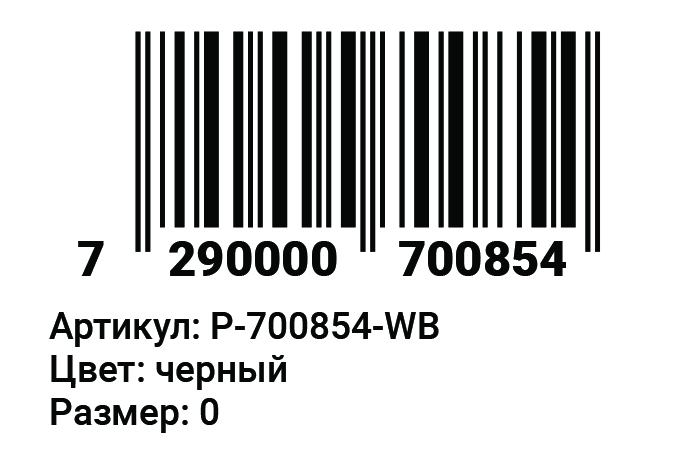

# PET-проект. Sticker Creator – генератор стикеров для склада

## Описание задачи и условия
Есть небольшая компания, которая поставляет товар в торговые сети и на маркетплейсы.
Одним из маркетплейсов, на который происходит реализация, является wildberries.ru. Для поставки товара на wildberries.ru на товар необходимо наклеить **стикер соответствующего образца**.

На складе у компании есть **принтер для печати стикеров.** Принтер печатает исключительно стикеры размером **58х40 мм** Для печати требуются стикеры в формате **pdf.** Также по требованию склада нужно, чтобы каждый стикер представлял собой **отдельный файл с наименованием формата штрих-код_артику.pdf.** Это важны момент. Т.к. многостраничный pdf cо стикерами для разных артикулов не подходит для работы. Работа склада поставлена таким образом, что, например, сегодня нужно напечатать 10 стикеров для продукта А. А завтра по 50 стикеров для продуктов B и С. Т.е. сотрудник заходит в папку, находит нужный стикер и печатает требуемое количество.

> **Откуда берется информация на стикере?**
Сотрудники сервисного отдела в рамках своей работы формируют **excel-файл** с необходимой информацией. Номер штрих-кода берется из данной таблицы. Сам штрих-код в формате **.svg** формируется и скачивается на стороннем ресурсе.
**Пример excel-файла для загрузки:**
(Шаблон в excel)[https://docs.google.com/spreadsheets/d/1LBzU09qD85x45q4IvihgdesSLrIX7BG9/edit?usp=share_link&ouid=104276769782258887882&rtpof=true&sd=true]

## Цель и предыстория
**Цель – оптимизировать рутинную работу**, которая ранее занимала много времени, т.к. проводилась с использованием Photoshop и сторонних ресурсов для генерации штрих-кода. **Схема работы выглядела так:** от сервисных сотрудников получался excel-файл с данными о штрих-кодах и дополнительной информацией, которая должна быть на стикере. Далее на стороннем сервисе генерировались штрих-коды для каждого стикера (при сохранении на стороннем ресурсе каждый штрих-код назывался barcode). Затем формировался файл нужных размеров в Photoshop, и в каждый файл добавлялся сформированный штрих-код  в .svg и дополнительная информация из excel-файла. Все выполнялось руками. После всех манипуляций каждый файл сохранялся в формате .pdf.

## В чем состоит оптимизация работы
Сейчас **процесс формирования стикеров занимает в разы меньше времени.** Сотрудник сервисного отдела предоставляет excel-файл с данными. Файл загружается в приложение. При нажатии на кнопку «Создать» на соответствующей строке с данными о стикере формируется превью стикера на экране. При нажатии кнопки «Скачать» стикер скачивается в формате pdf. При этом файл имеет необходимый размер и наименование.

## Как выглядит итоговый стикер
**Пример готового стикера:**

## Слабые места и доработки
На данный момент приложение работает и используется, но оно также в процессе доработки (есть много моментов, исправив которые, можно еще больше увеличить скорость получения готового результата). Работа над проектом ведется в свободное время. В проекте заложена возможность создавать стикер бОльшего размера, но данный сценарий не отработан до конца, т.к. цель была оптимизировать работу именно в данной компании, где размер стикера 58х40 мм и других размеров нет.

## Дополнительные комментарии
Реализована десктопная версия приложения без адаптивности. Мобильная версия не имеет смысла, т.к. в ней нет никакой необходимости. Данное небольшое приложение необходимо только для ускорения внутренних процессов, поэтому не уделялось большого внимание верстке и дизайну.
