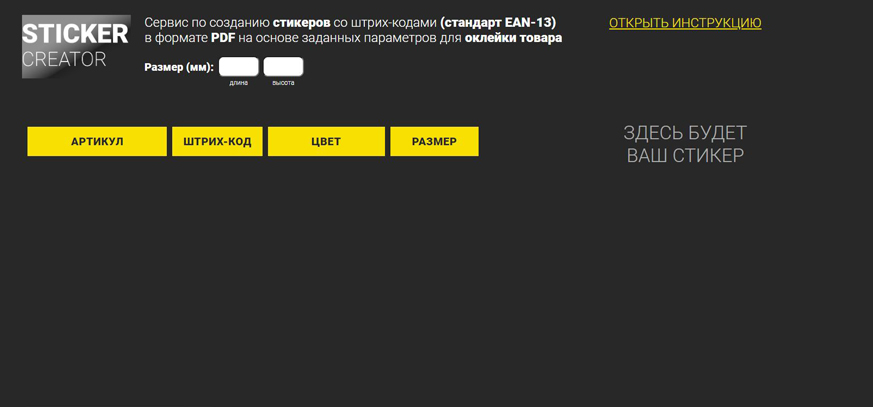

# PET-проект: Sticker Creator – генератор стикеров для склада

- [Описание задачи и условия](#описание-задачи-и-условия)
- [Цель и предыстория](#цель-и-предыстория)
- [В чем состоит оптимизация работы](#в-чем-состоит-оптимизация-работы)
- [Как выглядит итоговый стикер](#как-выглядит-итоговый-стикер)
- [Дополнительные комментарии](#дополнительные-комментарии)
- [Stack](#stack)
- [Описание работы приложения](#описание-работы-приложения)
- [Запуск проект](#запуск-проект)

## Описание задачи и условия
Есть небольшая компания, которая поставляет товар в торговые сети и на маркетплейсы.
Одним из маркетплейсов, на который происходит реализация, является wildberries.ru. Для поставки товара на wildberries.ru на товар необходимо наклеить **стикер соответствующего образца**.

На складе у компании есть **принтер для печати стикеров.** Принтер печатает исключительно стикеры размером **58х40 мм** Для печати требуются стикеры в формате **pdf.** Также по требованию склада нужно, чтобы каждый стикер представлял собой **отдельный файл с наименованием формата штрих-код_артику.pdf.** Это важный момент. Т.к. многостраничный pdf cо стикерами для разных артикулов не подходит для работы. Работа склада поставлена таким образом, что, например, сегодня нужно напечатать 10 стикеров для продукта А, а завтра по 50 стикеров для продуктов B и С. Т.е. сотрудник заходит в папку, находит нужный стикер и печатает требуемое количество.

> **Откуда берется информация на стикере?**
Сотрудники сервисного отдела в рамках своей работы формируют **excel-файл** с необходимой информацией. Номер штрих-кода берется из данной таблицы. Сам штрих-код в формате **.svg** формируется и скачивается на стороннем ресурсе.

**Пример excel-файла для загрузки:**

[Шаблон в excel](https://docs.google.com/spreadsheets/d/1LBzU09qD85x45q4IvihgdesSLrIX7BG9/edit?usp=share_link&ouid=104276769782258887882&rtpof=true&sd=true)

## Цель и предыстория
**Цель – оптимизировать рутинную работу**, которая ранее занимала много времени, т.к. проводилась с использованием Photoshop и сторонних ресурсов для генерации штрих-кода.

**Схема работы выглядела так:** от сервисных сотрудников получался excel-файл с данными о штрих-кодах и дополнительной информацией, которая должна быть на стикере. Далее на стороннем сервисе генерировались штрих-коды для каждого стикера (при сохранении на стороннем ресурсе каждый штрих-код назывался barcode). Затем формировался файл нужных размеров в Photoshop, и в каждый файл добавлялся сформированный штрих-код  в .svg и дополнительная информация из excel-файла. Все выполнялось руками. После всех манипуляций каждый файл сохранялся в формате .pdf с указанием нужного имени.

## В чем состоит оптимизация работы
Сейчас **процесс формирования стикеров занимает в разы меньше времени.** Сотрудник сервисного отдела предоставляет excel-файл с данными. Файл загружается в приложение. При нажатии на кнопку «Создать» на соответствующей строке с данными о стикере формируется превью стикера на экране. При нажатии кнопки «Скачать» стикер скачивается в формате pdf. При этом файл имеет необходимый размер и наименование.

## Как выглядит итоговый стикер
**Пример готового стикера:**


## Дополнительные комментарии
На данный момент приложение работает и используется, но здесь есть, что доработать.В проекте заложена возможность создавать стикер бОльшего размера, но данный сценарий не отработан до конца, т.к. цель была оптимизировать работу именно в данной компании, где размер стикера 58х40 мм, и других размеров нет. Реализована десктопная версия приложения без адаптивности. В мобильной версии нет никакой необходимости. Данное небольшое приложение необходимо только для ускорения внутренних процессов, поэтому не уделялось большого внимание верстке и дизайну.

## Stack
React, Redux Toolkit, TypeScript, Express

## Описание работы приложения

Укажите **размеры стикера в мм** и нажмите **«Загрузить данные»**


Выберите **excel-файл** на компьютере для загрузки


После загрузки таблицы выберите стикер, который хотите напечатать или скачать и нажмите **«Создать»**


Справа появится превью стикера. Нажмитие **«Скачать»**


В окне выберите **«Сохранить как PDF»** (если хотите сохранить на компьютер) или «Печать» 


Для очистки таблицы нажмите **«Очистить данные»**

**Стикер готов:**


Указанные действия также есть в инструкции. Для просмотра инструкции необходимо нажать «Открыть инструкцию» 


## Запуск проект

Необходимо, чтобы был установлен [Node.js](https://nodejs.org/en).

Установите завистимости в папках backend и frontend:
```sh
npm i
```

Запустите отдельно сервер и приложение командой:
```sh
npm run start
```
